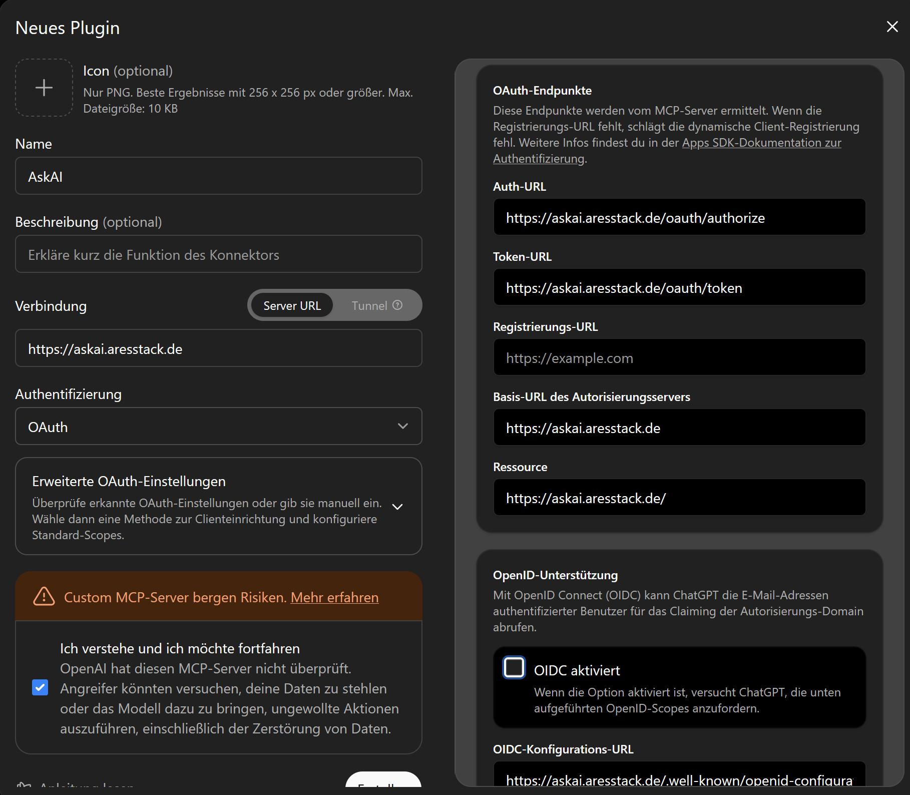
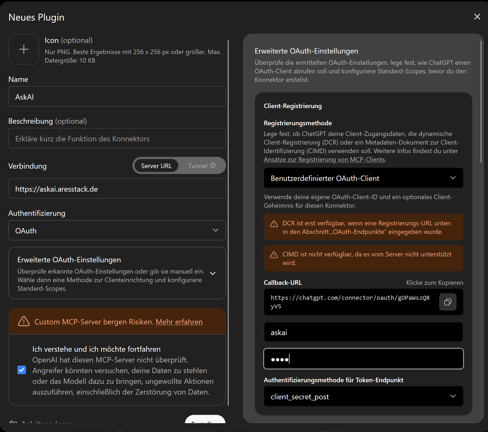
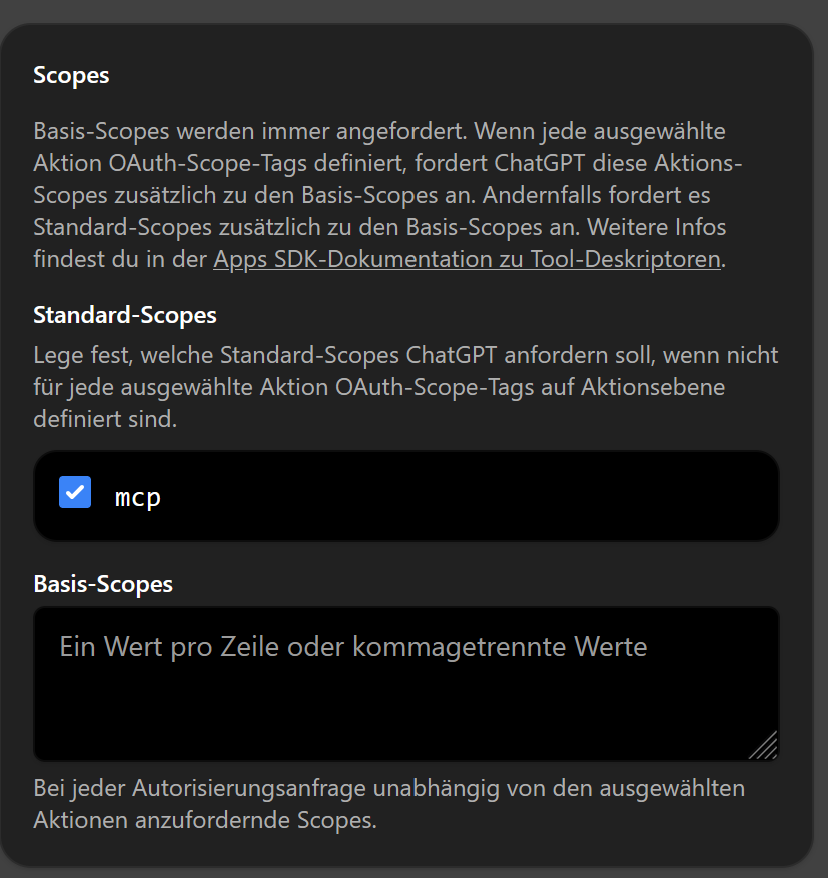

# AresStack Webserver

AresStack Webserver ist eine grafische Desktop-Anwendung, die lokale Dienste
unter eigenen Domains **automatisch per HTTPS** veröffentlicht.

Kein Apache, kein manuell gepflegter Reverse Proxy, keine Zertifikatsdateien,
keine ACME-Konfiguration, keine Server-Konfigurationsdateien. Der Benutzer
beschreibt nur das Ergebnis:

```
askai.aresstack.de  →  localhost:8082  →  HTTPS an  →  Publish
```

Alles Weitere — Reverse Proxy, Let's-Encrypt-Zertifikat, automatische
Erneuerung, HTTP→HTTPS-Umleitung, unterbrechungsfreie Konfigurations-
änderungen — übernimmt die Anwendung. Als Engine dient intern
[Caddy](https://caddyserver.com/) (gebündelt, checksummen-verifiziert);
für den Benutzer ist das ein Implementierungsdetail.

```
                    Internet
                       │
                 :80 / :443
                       │
                       ▼
               ┌───────────────┐
               │     Caddy     │   TLS · ACME · Reverse Proxy
               └───────┬───────┘
                       │  gesteuert über lokale Admin-API
               ┌───────┴───────┐
               │  AresStack    │   Java 21 · Swing · FlatLaf
               │  Webserver    │
               └───────┬───────┘
        ┌──────────────┼──────────────┐
        ▼              ▼              ▼
   localhost:8080  192.168.x.x    nas.local
```

## Funktionen

- **Geführte Veröffentlichung:** Jede Publikation ist eine Karte mit
  Gesamtstatus — `⚠ Action required` (mit der konkreten nächsten Handlung,
  z.B. dem exakten CNAME-Record samt Copy-Buttons), `◌ Setting up`,
  `◌ Not verified` oder `● Live`. Die Prüfkette (DNS → Backend → Ports →
  Zertifikat) läuft automatisch weiter, bis alles steht.
- **Ehrliche Zustände:** `● Live` erscheint nur nach positivem Nachweis der
  öffentlichen Erreichbarkeit; ein gültiges Zertifikat ist Zertifikats-,
  nicht Netzwerkstatus.
- **HTTPS automatisch:** Let's Encrypt inklusive Erneuerung, ohne dass je
  eine IP-Adresse oder Zertifikatsdatei eingetragen werden muss.
- **Pfad-Routing** (`/api/*` → anderes Backend) und Backend-HTTPS unter
  *Advanced* — der Standardfall bleibt drei Felder.
- **DNS-Modell:** Subdomains zeigen ausschließlich per **CNAME** auf die
  DynDNS-Basisdomain. Die Basisdomain hält der Router (oder der optionale
  eingebaute DynDNS-Client) aktuell.
- **Atomare Konfiguration:** Änderungen werden validiert (`caddy validate`)
  und per `/load` atomar übernommen — eine ungültige Konfiguration erreicht
  den laufenden Server nie, Routingänderungen brauchen keinen Neustart.
- **Robuster Lebenszyklus:** Ein bei einem früheren Anwendungslauf
  gestarteter Caddy wird über die Admin-API und eine persistierte
  Prozessidentität (`data/caddy/runtime.json`) wiedererkannt und adoptiert.
  Fremde Caddy-Instanzen werden niemals verändert oder gestoppt.

## Voraussetzungen

| Was | Warum |
|---|---|
| Windows, Java 21 | Laufzeitumgebung der Anwendung |
| Eigene Domain mit DynDNS (z.B. Router/FritzBox oder eingebauter Client) | `aresstack.de` zeigt immer auf den aktuellen Anschluss |
| Portweiterleitung **80** und **443** auf diesen Rechner | Let's-Encrypt-Validierung und öffentlicher Zugriff |

## Installation

1. Aktuelles Release laden: **[Releases → snapshot](../../releases/tag/snapshot)**
   (`aresstack-webserver-…-all.jar`, selbst lauffähiges Fat JAR inkl. Caddy).
2. Starten:

   ```
   java -jar aresstack-webserver-1.0-SNAPSHOT-all.jar
   ```

   Beim ersten Start entpackt die Anwendung die gebündelte `caddy.exe` nach
   `runtime/caddy/bin` im Arbeitsverzeichnis und zeigt sofort das
   Hauptfenster — es gibt keinen Einrichtungsassistenten.

   Bequemer geht es mit dem mitgelieferten Startskript, das eine der
   installierten Java-Versionen auswählen lässt und die Wurzel fest auf den
   Jar-Ordner setzt (siehe [Verzeichnisse](#verzeichnisse)):

   ```
   .\start-webserver.ps1
   ```

## Erster Dienst in drei Schritten

1. **+ Publish service** → öffentliche Adresse (`askai.aresstack.de`),
   Ziel (`localhost` / `8082`), HTTPS angehakt lassen → **Publish**.
2. Fehlt der DNS-Eintrag, zeigt die Karte ihn exakt so, wie ihn das
   Provider-Formular erwartet (`Type CNAME · Hostname askai · Target
   aresstack.de`, je mit Copy-Button, `?` öffnet die Anleitung).
3. Sobald DNS propagiert ist, holt die Anwendung das Zertifikat von selbst;
   die Karte wandert automatisch zu `● Live`.

## Verzeichnisse

Es gibt **kein** zentrales Konfigurationsverzeichnis im Benutzerprofil. Alle
Pfade liegen unterhalb einer Installationswurzel, die beim Start in dieser
Reihenfolge bestimmt wird:

1. erstes Argument, das nicht mit `--` beginnt (`java -jar … D:\webserver`)
2. `-Dwebserver.root=<pfad>` — so machen es `start-webserver.ps1` (Jar-Ordner)
   und die Startskripte aus `distZip` (`APP_HOME`)
3. sonst das **aktuelle Arbeitsverzeichnis**

Ein blankes `java -jar …` aus einem beliebigen Ordner landet also bei Punkt 3
und legt dort eine neue, leere Konfiguration an — die Anwendung startet dann
scheinbar „ohne" die bisherige Konfiguration. Das Startskript zeigt die
verwendete Wurzel und die Konfigurationsdatei beim Start an.

Unterhalb der Wurzel:

```
config/webserver.json    fachliche Konfiguration (Source of Truth)
generated/Caddyfile      generiertes Infrastrukturartefakt
data/caddy/              Zertifikate, Schlüssel, ACME-Konto — persistent,
                         darf bei Updates niemals gelöscht werden
logs/caddy.log           technisches Log (in der App: Logs → Technical log)
runtime/caddy/bin/       gebündeltes Caddy-Binary
```

`config/`, `data/` und `logs/` sind bei Updates zu erhalten; `bin/`, `lib/`,
`generated/` und `runtime/` sind ersetzbar.

Eine Ausnahme: reine Anwendungseinstellungen (Autostart des Servers,
DynDNS-Zugangsdaten) gehören nicht zur Serverkonfiguration und liegen über
`java.util.prefs` benutzerweit in der Registry unter
`HKCU\Software\JavaSoft\Prefs\com\aresstack\webserver` — unabhängig von der
Installationswurzel.

## Aus dem Quelltext bauen

```
gradlew downloadCaddy    lädt die gepinnte Caddy-Version (SHA-512-geprüft)
gradlew test             Unit- und Caddy-in-the-loop-Integrationstests
gradlew run              startet die Anwendung (Projektverzeichnis als Root)
gradlew fatJar           baut das selbst lauffähige Fat JAR
gradlew distZip          klassische ZIP-Distribution mit Startskripten
```

Jeder Push auf `master` baut über GitHub Actions ein rotierendes
Snapshot-Release (Windows, alle Tests inklusive echtem Caddy-Prozess).

## Sicherheit

- Die Caddy-Admin-API ist ausschließlich an Loopback gebunden
  (`127.0.0.1:29171`, bewusst nicht Caddys Default-Port) und wird nie ins
  LAN oder Internet exponiert.
- Das Caddy-Binary wird beim Build gegen die offiziellen Checksummen des
  GitHub-Releases verifiziert.
- Backend-Verbindungen mit HTTPS validieren Zertifikate regulär;
  `tls_insecure_skip_verify` wird niemals gesetzt.

## OAuth-Dienste veröffentlichen (z.B. ChatGPT-Konnektoren / MCP)

AresStack Webserver terminiert TLS und **reicht OAuth ausschließlich durch**.
Er ist kein OAuth-Server: Er verwaltet **weder `client_id` noch
`client_secret`**, stellt keine Token aus und kennt keine Scopes. Jede
Anfrage unter der veröffentlichten Domain — auch `/oauth/…` und
`/.well-known/…` — wird unverändert an das Ziel-Backend weitergereicht.

Damit die Delegation funktioniert, muss die **Ziel-Anwendung selbst** (hier
am Beispiel eines AskAI-MCP-Servers hinter `askai.aresstack.de`) Folgendes
können:

| Anforderung | Konkret |
|---|---|
| Eigene OAuth2-Endpunkte unter der öffentlichen Domain | z.B. `https://askai.aresstack.de/oauth/authorize` und `…/oauth/token` — die Pfade sind frei wählbar, müssen aber über die veröffentlichte HTTPS-Adresse erreichbar sein |
| OIDC-Discovery (falls OpenID Connect genutzt wird) | `https://askai.aresstack.de/.well-known/openid-configuration` mit korrekten absoluten URLs |
| Client-Verwaltung | `client_id`/`client_secret` erzeugen, speichern und prüfen (z.B. `client_secret_post` am Token-Endpunkt); die Callback-URL des Konsumenten whitelisten (bei ChatGPT: `https://chatgpt.com/connector/oauth/…`) |
| Scopes definieren und durchsetzen | z.B. der Scope `mcp` für ChatGPT-MCP-Konnektoren |
| Proxy-Bewusstsein | Die Anfrage kommt vom Webserver per HTTP im LAN an; ausgegebene URLs (Issuer, Redirects) müssen trotzdem die öffentliche `https://`-Adresse verwenden — dafür die von Caddy gesetzten `X-Forwarded-Proto`/`X-Forwarded-Host`-Header auswerten |
| Dynamic Client Registration (optional) | Wird DCR nicht unterstützt, bleibt die Registrierungs-URL beim Konsumenten leer und es wird ein benutzerdefinierter Client mit festen Zugangsdaten verwendet |

So sieht die Gegenseite aus — die Einrichtung eines ChatGPT-Konnektors
gegen einen hinter AresStack Webserver veröffentlichten Dienst:

**OAuth-Endpunkte:** Auth-, Token- und OIDC-Konfigurations-URL zeigen alle
auf die veröffentlichte Domain; der Webserver leitet sie nur weiter.



**Benutzerdefinierter OAuth-Client:** `client_id` und `client_secret`
stammen aus der Ziel-Anwendung (nicht aus AresStack Webserver) und werden
beim Konsumenten hinterlegt; dessen Callback-URL muss die Ziel-Anwendung
akzeptieren.



**Scopes:** Auch die Scopes (hier `mcp`) definiert und prüft die
Ziel-Anwendung.



## Lizenz

Caddy ist Apache-2.0-lizenziert; die Lizenz liegt dem Release unter
`licenses/caddy/` bzw. im Fat JAR bei.
